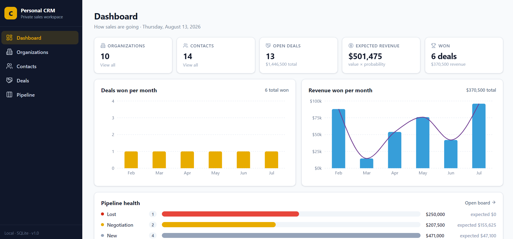
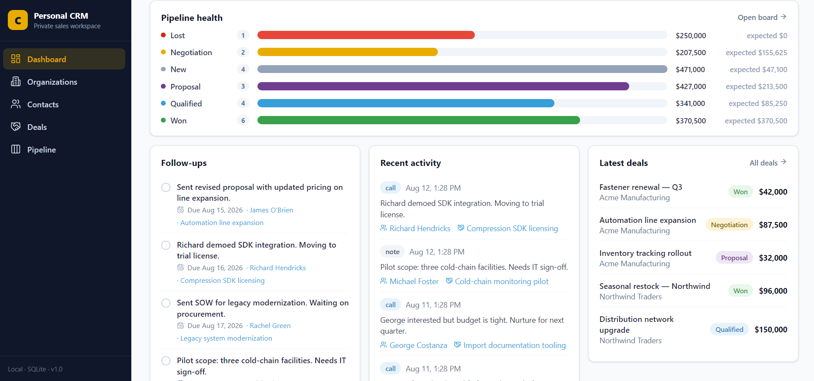
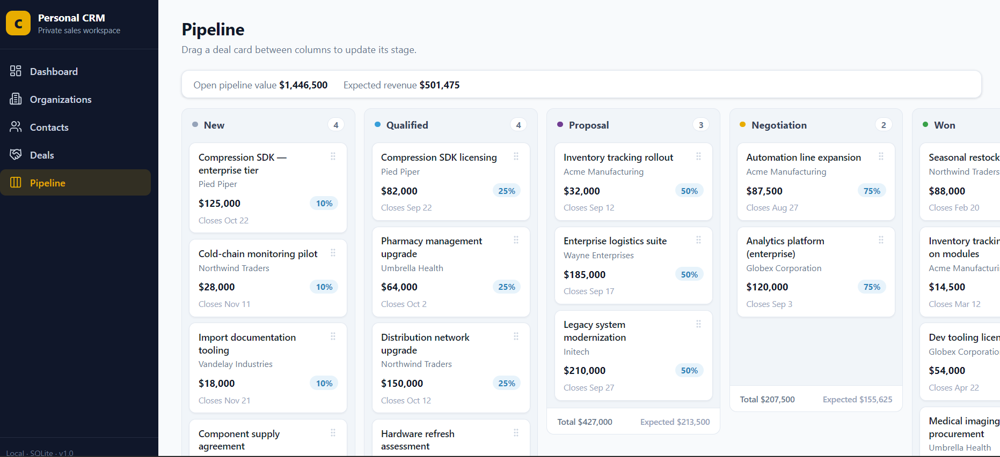
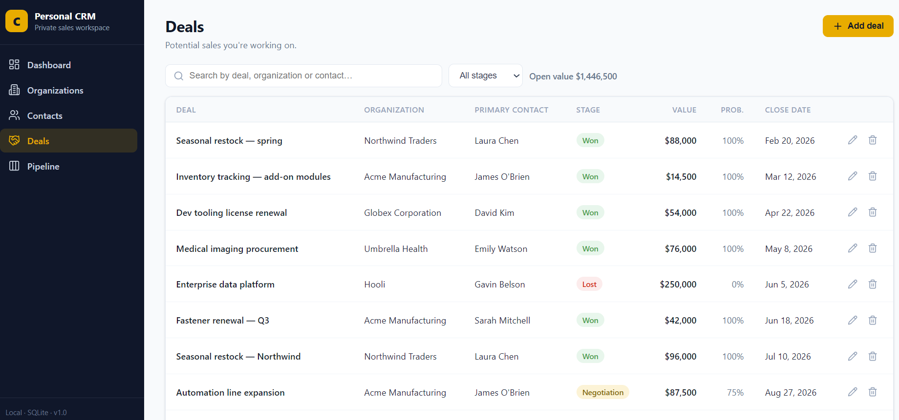
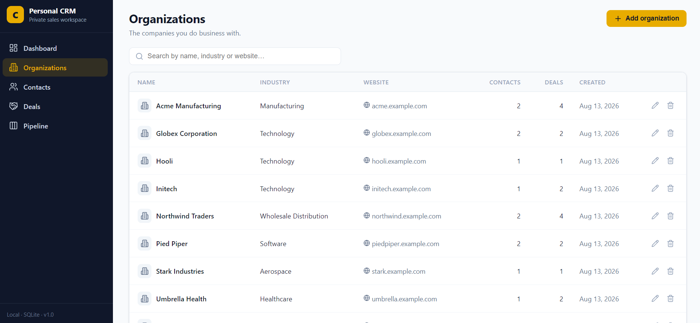
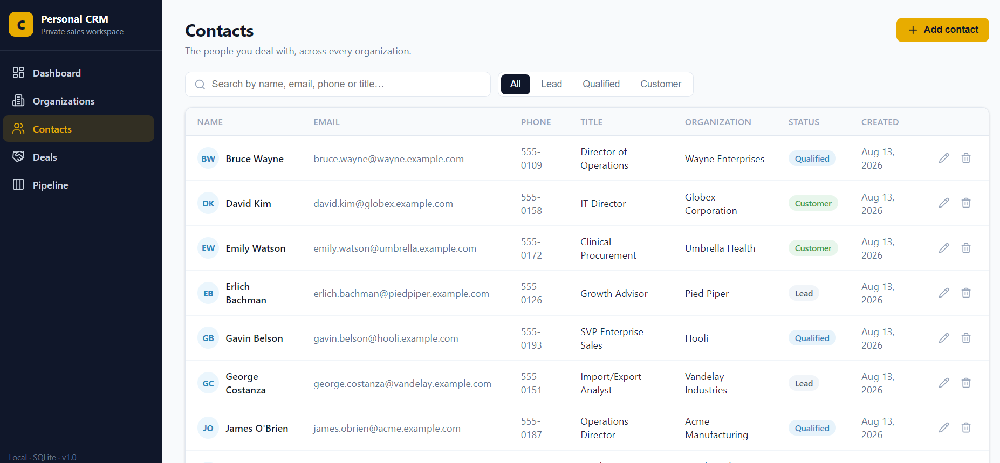

<div align="center">

# Personal CRM

A lightweight, local-first Customer Relationship Management (CRM) application for developers and small teams who want to manage organizations, contacts, deals, and activities without relying on a third-party CRM platform. The application runs locally with SQLite and pairs a responsive React + Vite frontend with a simple Express API.

### Live Demo

[**Open Personal CRM →**](https://crm-pro-6bdn.onrender.com/)


<p>If you find my project helpful, please give me a star ⭐ on GitHub!</p>

---

</div>

## Table of Contents

* [Features](#features)
* [Live Demo](#live-demo)
* [Preview](#preview)
* [Tech Stack](#tech-stack)
* [Requirements](#requirements)
* [Getting Started](#getting-started)
* [Production Build](#production-build)
* [Deployment](#deployment)
* [Configuration](#configuration)
* [Data & Seeding](#data--seeding)
* [Project Structure](#project-structure)
* [Available Scripts](#available-scripts)
* [Testing](#testing)
* [Architecture Notes](#architecture-notes)
* [Security & Privacy](#security--privacy)
* [Quick Links](#quick-links)

---

## Features

* **Dashboard** - won deals, monthly revenue, pipeline health, and upcoming follow-ups at a glance
* **Organizations & Contacts** - searchable lists with detail pages for each record
* **Deals Pipeline** - six-stage kanban board (New → Qualified → Proposal → Negotiation → Won/Lost) with drag-and-drop stage changes via `dnd-kit`
* **Activity Logging** - notes, calls, and emails with due dates and task tracking
* **Local-first** - designed to run without a third-party CRM service, with data stored in SQLite
* **Single-process production server** - Express serves the API and compiled frontend together
* **Responsive UI** - designed for a clean experience across desktop and smaller screens

## Live Demo

Try the deployed version of Personal CRM:

**👉 https://crm-pro-6bdn.onrender.com/**

The live deployment provides a convenient way to preview the application without installing it locally.

> **Note:** The local version is designed around SQLite and local data storage. The hosted demo is provided primarily for preview and demonstration purposes.

## Preview

<table>
  <tr>
    <td width="50%"><strong>Dashboard</strong><br/></td>
    <td width="50%"><strong>Pipeline Health</strong><br/></td>
  </tr>
  <tr>
    <td width="50%"><strong>Deals Pipeline</strong><br/></td>
    <td width="50%"><strong>Deals List</strong><br/></td>
  </tr>
  <tr>
    <td width="50%"><strong>Organizations</strong><br/></td>
    <td width="50%"><strong>Contacts</strong><br/></td>
  </tr>
</table>

## Tech Stack

| Layer      | Technology                                      |
| ---------- | ----------------------------------------------- |
| Frontend   | React 18, TypeScript, Vite, `dnd-kit`, Recharts |
| Backend    | Express, `better-sqlite3`                       |
| Database   | SQLite (local file, zero setup)                 |
| Testing    | Vitest                                          |
| Deployment | Render                                          |

## Requirements

* **Node.js 20+** (developed and tested on Node 24)
* npm (bundled with Node.js)

## Getting Started

### 1. Install dependencies

```bash
npm install
```

### 2. Run in development mode

Frontend and API run together:

```bash
npm run dev
```

### 3. Open the app

Visit:

**http://localhost:4900**

The Vite development server runs on port `4900` and proxies API requests to the backend on port `4901`.

## Production Build

Build the frontend and start the single-process server that serves both the API and the compiled frontend:

```bash
npm run build && npm start
```

The production server uses the `PORT` environment variable when provided, which allows it to run correctly on platforms such as Render.

## Deployment

The application is deployed on **Render** as a single Node.js service.

### Live Application

**https://crm-pro-6bdn.onrender.com/**

The deployment runs the production build and exposes the React frontend together with the Express API through the same server.

### Deploy Your Own Instance

To deploy your own instance:

1. Fork or clone this repository.
2. Create a new **Web Service** on Render.
3. Connect the GitHub repository.
4. Configure the service to use Node.js.
5. Use the following build command:

```bash
npm install && npm run build
```

6. Use the following start command:

```bash
npm start
```

7. Deploy the service.

Render provides the `PORT` environment variable automatically, and the application is configured to use it for the production server.

> **Important:** The application uses SQLite. For a production deployment where persistent data must survive server restarts or redeployments, configure persistent storage or use a production database such as PostgreSQL. The included Render deployment is primarily intended as a live preview/demo.

## Configuration

All configuration is optional - the app works out of the box with sensible defaults.

| Variable   | Description                                   | Default       |
| ---------- | --------------------------------------------- | ------------- |
| `CRM_DB`   | Path to the SQLite database file              | `data/crm.db` |
| `API_PORT` | Backend API port (development)                | `4901`        |
| `PORT`     | Port for the single-process production server | `4900`        |

## Data & Seeding

On first run, the app automatically creates the `data/` folder and a SQLite database.

The repository ships with seed data (`server/seed.ts`) that populates realistic organizations, contacts, deals, and activities, so you can explore the application immediately without manual setup.

## Project Structure

```text
├── server/          # Express API, DB migrations, seed data
│   ├── index.ts     → API entry point
│   ├── db.ts        → schema, migrations & DB helpers
│   └── seed.ts      → sample data generator
├── src/             # React + TypeScript frontend
│   ├── components/  → UI components
│   └── pages/       → application views
├── data/            # SQLite database (created automatically)
└── test/            # Unit tests (Vitest)
```

## Available Scripts

| Script            | Description                                                     |
| ----------------- | --------------------------------------------------------------- |
| `npm run dev`     | Run backend + frontend together in development (`concurrently`) |
| `npm run dev:api` | Run the API only, in watch mode                                 |
| `npm run dev:web` | Run the Vite development server only                            |
| `npm run build`   | Type-check and build the frontend for production                |
| `npm start`       | Run the single-process production server                        |
| `npm test`        | Run the test suite with Vitest                                  |

## Testing

```bash
npm test
```

The test suite covers:

* Core CRUD operations
* Search and filter behavior
* Pipeline stage changes
* Activity/task toggling

Tests run against an in-memory database where appropriate.

## Architecture Notes

* **Frontend** - React + TypeScript, built with Vite; key UI components live under `src/components/`
* **Backend** - Express API reading/writing to a SQLite database via `better-sqlite3`
* **Dev proxy** - Vite proxies `/api` requests to `http://localhost:4901` (see `vite.config.ts`)
* **Production server** - Express serves the compiled frontend and API from a single process
* **Migrations** - applied automatically by `server/db.ts` on startup, with no manual migration steps required
* **Database** - SQLite keeps the local development experience lightweight and requires zero database infrastructure

## Security & Privacy

The local version stores application data in:

```text
data/crm.db
```

The application has **no built-in authentication** and is designed primarily as a personal/local CRM.

If you expose your own instance publicly, add an authentication and authorization layer before using it with sensitive customer information.

The hosted demo should **not** be used for confidential, personal, or production customer data.

## Quick Links

* **[Live Demo](https://crm-pro-6bdn.onrender.com/)**
* [`package.json`](package.json) - dependencies & scripts
* [`server/index.ts`](server/index.ts) - API entry point
* [`server/db.ts`](server/db.ts) - DB schema & helpers
* [`server/seed.ts`](server/seed.ts) - seed data
* [`vite.config.ts`](vite.config.ts) - Vite config & dev port/proxy setup


<div align="center">
  Made with ❤️ by Mustafa
</div>

---
